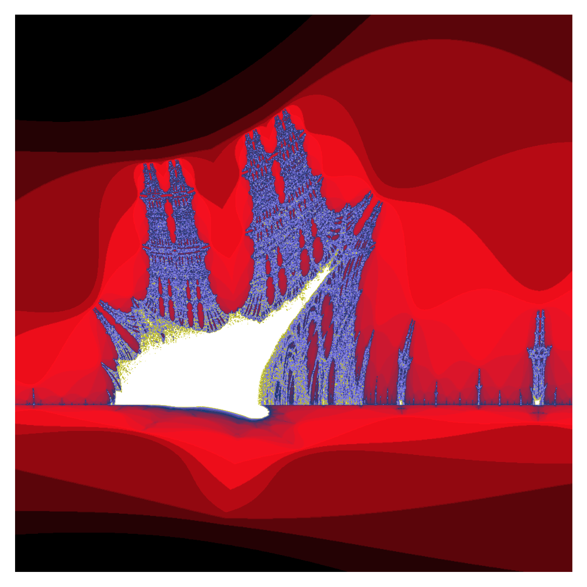
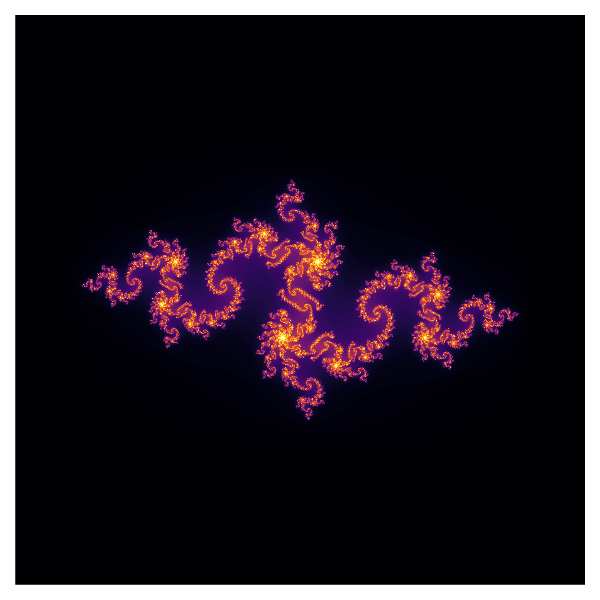

# Fractals, in Python!

PyFractal generates [fractals](https://en.wikipedia.org/wiki/Fractal) in the command line.  

## Table of Contents
* [General info](#general-info)
* [Usage](#usage)
* [Example gallery with code](#example-gallery-with-code)
* [Features](#features)

## General info
`pyfractal` generates fractal images using `numpy` and `matplotlib`.  It was inspired by [this](https://matplotlib.org/stable/gallery/showcase/mandelbrot.html#sphx-glr-gallery-showcase-mandelbrot-py) `matplotlib` example for rendering the Mandelbrot set. While it can currently render the Mandelbrot set, the Julia set, and the Burning Ship fractal, I plan to add more fractals as time allows.  `pyfractal` has a command line interface that allows the user to generate and save images at different levels of magnification and with different [matplotlib color pallets](https://matplotlib.org/stable/tutorials/colors/colormaps.html).   

Currently supported fractals:
* [Mandelbrot](https://en.wikipedia.org/wiki/Mandelbrot_set): `mandelbrot`
* [Julia](https://en.wikipedia.org/wiki/Julia_set): `julia`
* [Burning ship](https://en.wikipedia.org/wiki/Burning_Ship_fractal): `burning-ship`

## Usage
`pyfractal` is built to interface with the command line.   

To start using `pyfractal` clone this GitHub repository and set the working directory to `python-fractals`.   

Running `pyfractal` without any arguments will by default generate the Mandelbrot set using the `RdBu_r` color map.  
``python -m pyfractal``

### Rendering
`-f [FRACTAL]` renders the specified fractal.  Default is `mandelbrot`.   When used without argument selects a fractal at random.  
`-c [COLOR]` uses the specified [matplotlib colormap](https://matplotlib.org/stable/tutorials/colors/colormaps.html).  Default is `RdBu_r`.   When used without argument selects a random colormap.  
`-i [INTERPOLATION]` The [matplotlib imshow interpolation](https://matplotlib.org/stable/gallery/images_contours_and_fields/interpolation_methods.html) to use when rendering the fractal.  Default is `bilinear`.

### Image zoom and position
`-x CENTER_POINT` The center point of the image in complex coordinates `<real> <imaginary>`.  For example, `-x 0.2 1.3` centers the rendered image at `0.2` on the horizontal real axis and `-1.3` on the vertical imaginary one.  If the user specifies only one of the real or imaginary parts, the script treats the other as `0`.  E.g. `-x -0.9` centers the image at `-0.9` on the horizontal and `0` on the vertical.  
`-w WIDTH` specifies the width of the square image.  This allows for zooming in on a fractal and is particularly useful when combined with the `-x` argument.  For example `-x 1 0.5 -w .2` centers the image at `1 0.5` and displays real values ranging from `0.9` through `1.1` and imaginary value from `0.4` through `0.6`.  

### Saving
`-s [FILE-PATH]` Saves the image to disk as a `.png` file.  By default the image is saved to the project's `fractal_images` sub-directory.  The user can also specify a path to a directory.  The default image name is `<fractal-name>_<date>_<time>.png`.  In the future I'll make this customizable.  

## Example gallery with code
Close up of Mandelbrot with default colormap.  
`python -m pyfractal -f mandelbrot -x -1.39 0 -w .1`  

---

Magnification of largest ship to left of main ship in Burning Ship fractal.  Burning Ship is slightly less pixelated with `bicubic` interpolation.   
`python -m pyfractal -f burning-ship -x -1.74 -.03 -w .15 -c gist_stern -i bicubic`

---

Julia set with random color map applied and saved to directory `/User/foo/bar`.    
`python -m pyfractal -f julia -c -s /User/foo/bar`

## Features
* Supported fractals:
  * Mandelbrot: `mandelbrot`
  * Julia: `julia`
  * Burning ship: `burning-ship`
* Render fractals using any [Matplotlib color pallet](https://matplotlib.org/stable/tutorials/colors/colormaps.html).
* Render close up images of fractal by defining an image width around a center point.
### To do:
- [ ] More fractal choices.
- [ ] Specify complex value argument `c` in z_i = z_{i-1}^2 + c.
- [ ] Allow user to change image resolution using the command line.
- [ ] Specify exact real and imaginary points of image corners.
### Known issues:
* Script replaces `(x, j)` with `(-x, j)` when rendering close zooms of Burning ship fractal.  Maybe other fractals too but not sure at this point since Mandelbrot and Julia are symmetric.  
