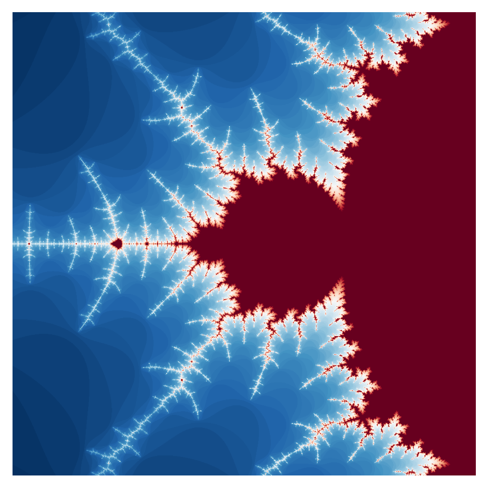

# Fractals, in Python!

PyFractal generates fractals in the command line.  

## Table of Contents
* [General info](#general-info)
* [Setup](#setup)
* [Features](#features)
* [Examples](#examples)

## General info

## Setup

## Features
* Supported fractals:
  * Mandelbrot: `mandelbrot`
  * Julia: `julia`
  * Burning ship: `burning-ship`
* Render fractals using any [Matplotlib color pallet](https://matplotlib.org/stable/tutorials/colors/colormaps.html). 
* Render close up images of fractal by defining an image width around a center point.
### To do:
* More fractal choices.
* Allow user to change image resolution using the command line.
* Specify exact x and y verticies of image corners.
### Issues:
* Script replaces (x, j) with (-x, j) when rendering close zooms of Burning ship fractal.  

## Examples
`python -m pyfractal -f mandelbrot -x -1.39 -w .1`  

